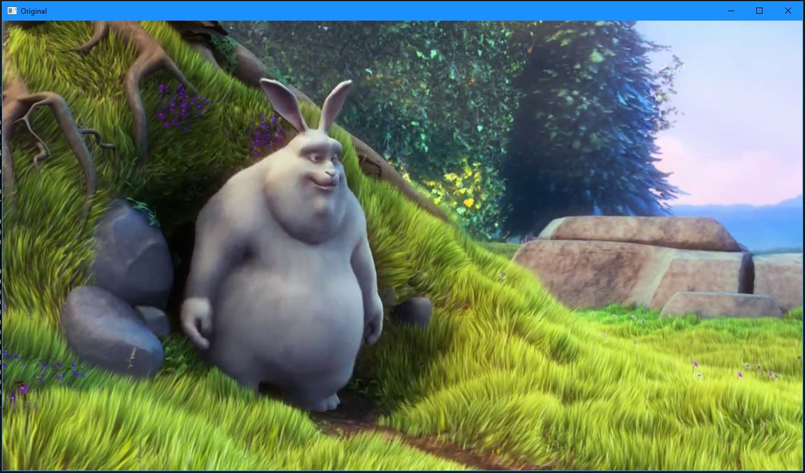
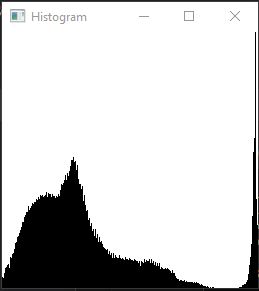
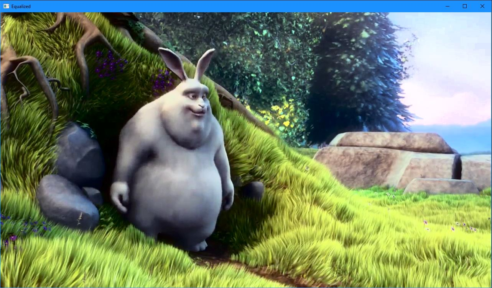

## ITMO Computer Vision Course 2022

# Лабораторная работа №1

---

## Вариант 2. Эквализация гистограммы

**Вариант задания №2:**

*Эквализация гистограммы. На вход поступает видео, программа на 
выходе отрисовывает два окна: с рассчитанной гистограммой и 
изображением. По нажатию определенной кнопки на клавиатуре 
изображение должно переключаться между исходным и после 
эквализации. Базовый алгоритм - эквализация гистограммы.*

**Цель работы:**

Освоить навык реализации одного из базовых алгоритмов обработки изображений.

**Задание:**

1. Создать программу в соответствии с выбранным заданием. Необходимо реализовать базовый алгоритм в трех вариантах: с использованием встроенных функций из библиотеки (OpenCV, PIL и т.д.), с использованием чистого Python и |с использованием Numba или C++|.
2. Сравнить производительность реализованных вариантов..
3. Создать отчет в формате README на GitHub, который также будет содержать исходный код.

---

## Теоретическая база

---

[Эквализация гистограмм для повышения качества изображений / Хабр](https://habr.com/ru/post/244507/)

[Эквализация гистограмм &ndash; LightHouse Software](https://lhs-blog.info/programming/dlang/ekvalizacziya-gistogramm/)

[Предобработка данных](http://cs.mipt.ru/advanced_python/lessons/lab27.html)

---

## Описание разработанной системы

---

### Общее описание

Для выполнения задания были написано три скрипта программы на языке Python: основная с использованием библиотеки OpenCV, одна на циклах и дополнительная с компилируемыми функциями при помощи Numba. Компиляция и запуск программ осуществлялись в среде Windows 10.

В основном каталоге проекта можно обнаружить две папки: media и scripts. В папке media находятся входное видео, а в папке scripts располагаются три скрипта:

- main_opencv.py - с использованием библиотеки opencv для рассчёта гистограммы

- main_not_opencv.py - без использования библиотеки opencv для рассчёта гистограммы, реализация базовыми циклами

- main_numba.py - с использованием библиотеки namba для компиляции функциидля рассчёта гистограммы

 Три скрипта нужны для сравнения производительности выполняемой задачи

### Алгоритм работы программы

Общее описание алгоритма программы на языке Python выглядит так:

1. Подключаем необходимые библиотеки и модули.
2. Описываем функцию для рассчёта и получения гистограммы
3. Описываем функцию для эквализации изображения
4. Считываем видеофайл и извлекаем фрейм, соответствующий заданной временной метке.
5. Загружаем изображение, которое будет вычитаться из выбранного фрейма видео.
6. Если извлечение фрейма прошло успешно, то подгатавливаем окно для показа оригинального изображения и сразу показываем его
7. Забираем гистограмму эквализированного изображения
8. Подгатавливаем окно для показа гистограммы оригинального изображения и сразу показываем её
9. Эквализируем изображение
10. Устанавливаем обработчик нажатия клавиш с клавиатуры
11. Указываем действие при нажатии клавиши "x" - переключение между оригинальным изображением и его гистограммой и эквализированным изображением и его гистограммой
12. Устанавливаем действие при нажатии клавиши "q" - завершение работы программы
13. После завершения основнго цикла, программа закрывает окна и освобождает занимаемую ими память.

## Результаты работы и тестирования системы

---

Полученный фрейм из видеопотока:

Рис.1 - Оригинальное изображение

Рис.2 - Гистограмма оригинального изображения

Рис.3 - Эквализированное изображение

Рис.4 - Гистограмма эквализированного изображения

### Время исполнения операции:

- **OpenCV python:** 0.75 мс

- **Циклы python:** 3692.47 мс

- **Numba Python:** 581.88 мс

---

## Итог

---

В рамках проекта был создан алгоритм базовой эквализации гистограммы и изображения, используя язык программирования Python с библиотекой OpenCV. Также для ускорения работы программы была применена библиотека numba. Было установлено, что использование оптимизированных библиотечных функций является предпочтительным и значительно ускоряет процесс обработки изображений (в данном проекте практически в 5000 раз).
